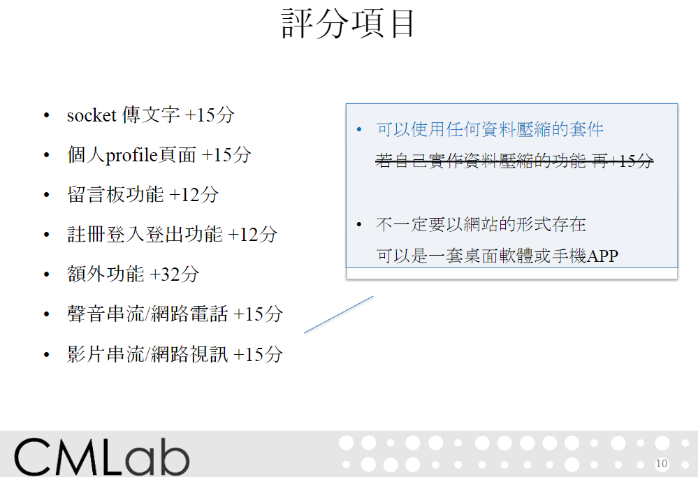

# Final Project

The website is developed using React.js and Node.js.

Requirements left: 
- 聲音/電話 (audio live streaming)
- 影片/視訊 (video live streaming)



## Getting Started

Currently run on `node.js v14.17.3`. `nvm` is recommended to manage node versions. All dependencies are specified in the `package.json` file.


## Installation and Setup Instructions

1. Install dependencies: `npm install`. 

2. For the message board, run the json-server database (optional):
    ```bash
    npm install -g json-server
    json-server --watch db.json --port 3001
    ```
    The database is now running on [http://localhost:3001](http://localhost:3001).

3. For the audio live streaming, run the server (on it, GPT code):
    ```bash
    node ./src/Audio/broadcast.js
    ```
    The server is now running on [http://localhost:3002](http://localhost:3002).
    `./src/components/Final/Audio.jsx` is the frontend code for the audio live streaming and needs to be modified to connect to the server.

4. For the video live streaming, run the server (not working yet):
    ```bash
    node ./src/Video/broadcast.js
    ```
    The server is now running on [http://localhost:3003](http://localhost:3003).
    `./src/components/Final/Video.jsx` is the frontend code for the video live streaming and needs to be modified to connect to the server.
5. Run the app:
    ```bash
    PORT=5173 npm start
    ```
    or
    ```powershell
    ($env:PORT = "5173"); npm start
    ```
    Now access the webapp in [http://localhost:5173](http://localhost:5173).